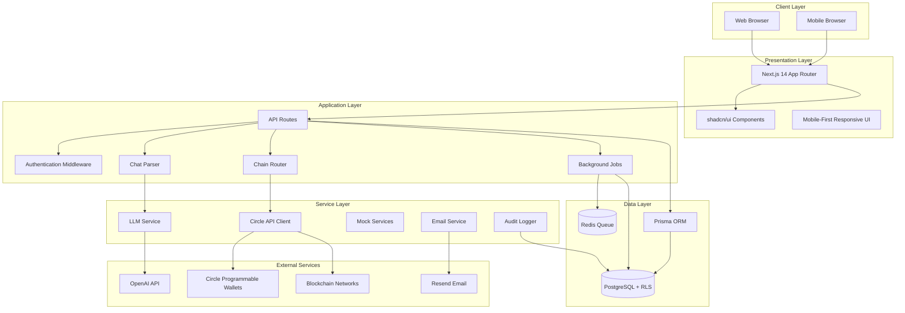
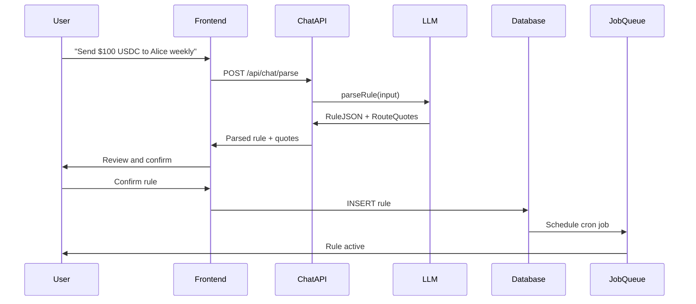
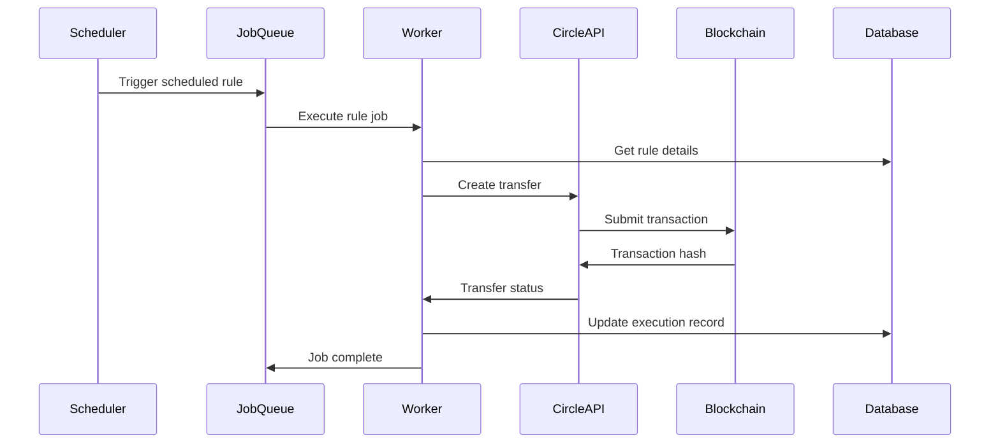
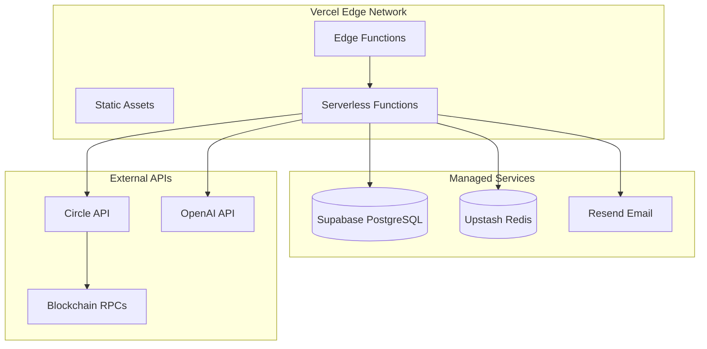
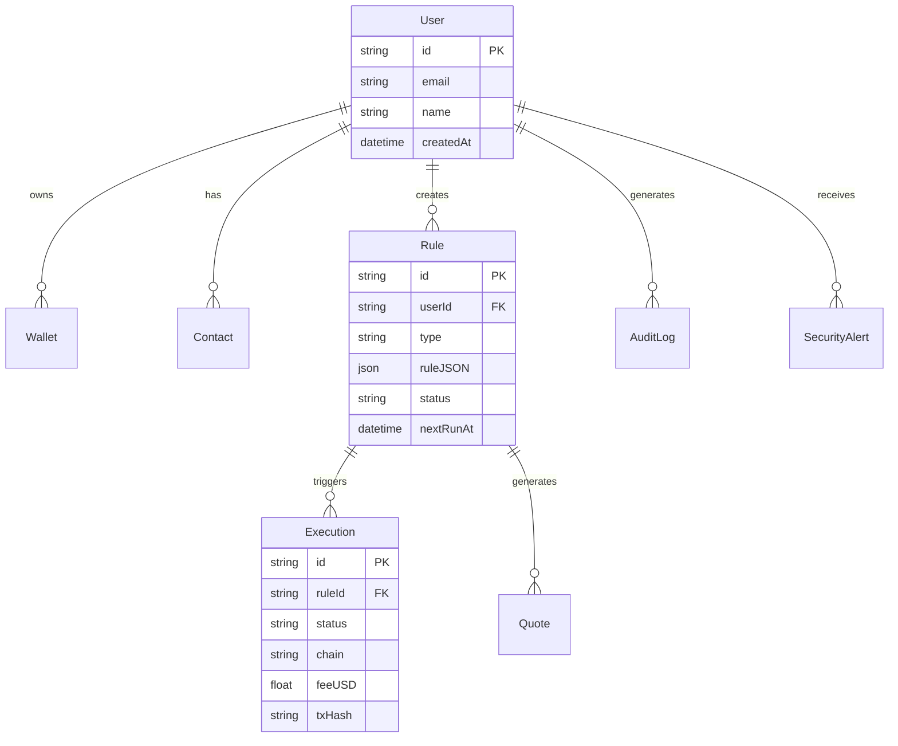

# 🏗️ Ferrow System Architecture

**Ferry funds across chains, automatically**

An AI-powered stablecoin automation platform with intelligent cross-chain routing and Circle Programmable Wallets integration.

## 📋 Table of Contents

- [System Overview](#system-overview)
- [High-Level Architecture](#high-level-architecture)  
- [Core Components](#core-components)
- [Data Flow](#data-flow)
- [Security Architecture](#security-architecture)
- [Infrastructure](#infrastructure)
- [Technology Stack](#technology-stack)
- [API Architecture](#api-architecture)
- [Database Schema](#database-schema)
- [Integration Points](#integration-points)
- [Deployment Architecture](#deployment-architecture)
- [Scalability Considerations](#scalability-considerations)

---

## 🎯 System Overview

### Core Functionality
- **Natural Language Processing**: Convert user intent to structured automation rules
- **Cross-Chain Intelligence**: Optimal routing across Ethereum, Base, Arbitrum, Polygon
- **Automated Execution**: Schedule-based and condition-triggered transfers
- **Circle Integration**: Programmable Wallets for secure USDC/EURC transactions
- **Real-time Monitoring**: Comprehensive tracking and audit trails

### Key Capabilities
- 🤖 AI-powered rule creation via chat interface
- ⚡ Multi-chain transaction routing with cost optimization  
- 🔒 Enterprise-grade security with RLS and audit logging
- 📊 Real-time dashboard with KPIs and analytics
- 🔄 Background job processing with BullMQ
- 🌐 Production-ready deployment on Vercel
- 🛡️ **NEW:** Safety-first architecture with circuit breakers
- 📱 **NEW:** Progressive Web App (PWA) capabilities
- 🔍 **NEW:** Comprehensive observability with Sentry
- 📈 **NEW:** Real-time gas and FX oracles
- 🔐 **NEW:** Advanced secrets management
- ⚠️ **NEW:** Dead Letter Queue (DLQ) for failed jobs

---

## 🏗️ High-Level Architecture



---

## 🧩 Core Components

### 1. Frontend Layer
```typescript
// Next.js 14 App Router Structure
├── app/
│   ├── (dashboard)/          # Protected dashboard routes
│   │   ├── page.tsx         # Dashboard home with KPIs
│   │   ├── rules/           # Rule management
│   │   ├── transfers/       # Transfer history
│   │   └── settings/        # System configuration
│   ├── auth/                # Authentication pages
│   └── api/                 # Backend API routes
```

**Key Features:**
- 📱 Mobile-first responsive design
- 🎨 shadcn/ui component system
- ⚡ Server-side rendering for performance
- 🔐 NextAuth.js authentication

### 2. Chat-Based Rule Creation
```typescript
// Natural Language → Structured JSON
"Send $50 USDC to John every Friday at 8am on the cheapest chain"
↓ [AI Processing]
{
  type: "schedule",
  asset: "USDC",
  amount: { type: "fixed", value: 50, currency: "USD" },
  destination: { type: "contact", value: "John" },
  schedule: { cron: "0 8 * * FRI", tz: "America/New_York" },
  routing: { mode: "cheapest", allowedChains: [...] }
}
```

### 3. Multi-Chain Routing Engine
```typescript
// Intelligent Chain Selection
interface RouteQuote {
  chain: Chain;
  estimatedFeeUSD: number;
  estimatedTimeSeconds: number;
  confidence: number;
  reasoning: string;
}

// Routing Strategies:
- Cheapest: Minimize transaction fees
- Fastest: Minimize execution time  
- Fixed: Use specific chain
- Smart: Balance cost vs speed
```

### 4. Background Job System
```typescript
// BullMQ Job Types
- ScheduledExecution: Cron-based rule execution
- ConditionalCheck: Market condition monitoring
- WebhookProcessing: Circle callback handling
- AuditLogging: Security event recording
- EmailNotification: User communications
```

---

## 🔄 Data Flow

### Rule Creation Flow


### Execution Flow


---

## 🛡️ Enhanced Reliability & Safety Architecture

### Safety Controller
The enhanced architecture introduces a comprehensive safety-first approach:

```typescript
// Circuit Breaker Protection
SafetyController.executeWithProtection('CIRCLE_API', async () => {
  return await circleClient.createTransfer(params);
});

// System Health Monitoring
const health = await SafetyController.getSystemHealth();
// Returns: 'healthy' | 'degraded' | 'critical'

// Safety Policy Enforcement
const validation = SafetyController.validateExecution({
  amountUSD: 1000,
  userId: 'user_123',
  concurrentExecutions: 5
});
```

### Circuit Breaker System
Protects against cascading failures across all external services:

| Service | Failure Threshold | Recovery Timeout | Monitoring Window |
|---------|------------------|------------------|-------------------|
| Circle API | 5 failures | 2 minutes | 5 minutes |
| Gas Oracle | 3 failures | 30 seconds | 1 minute |
| FX Oracle | 2 failures | 1 minute | 5 minutes |
| LLM Service | 3 failures | 45 seconds | 3 minutes |
| Secrets Manager | 2 failures | 15 seconds | 1 minute |

### Dead Letter Queue (DLQ)
Failed jobs are automatically captured and made available for manual retry:

```typescript
// Failed jobs are automatically sent to DLQ
const dlqStats = await dlq.getDLQStats();
// { totalEntries: 12, retryableEntries: 8, entriesByQueue: {...} }

// Batch retry with conditions
const result = await dlq.batchRetry({
  queue: 'execute-rule',
  errorPattern: /timeout/i,
  maxAge: 24 * 60 * 60 * 1000 // 24 hours
}, 10);
```

### Progressive Web App (PWA)
Enhanced mobile experience with offline capabilities:

- 📱 **App-like Experience**: Install on home screen
- 🔄 **Service Worker**: Background sync for failed transfers  
- 📴 **Offline Mode**: Cached data access when disconnected
- 🔔 **Push Notifications**: Real-time transfer updates
- ⚡ **Fast Loading**: Cached resources and prefetching

### Observability Stack
Comprehensive monitoring with Sentry integration:

```typescript
// Error Tracking with Context
Observability.captureError(error, {
  userId: 'user_123',
  ruleId: 'rule_456',
  component: 'transfer-execution',
  metadata: { chain: 'ethereum', amount: 100 }
});

// Performance Monitoring
const transaction = startTransaction('execute-rule', 'job');
// ... execute job
transaction.finish();

// Business Metrics
trackBusinessMetric('daily_volume_usd', 15000, { chain: 'base' });
```

### Oracle Services
Real-time market data with fallback mechanisms:

```typescript
// Gas Price Oracle
const gasPrice = await GasOracle.getGasPrice('ethereum');
const cheapest = await GasOracle.getCheapestChain(['ethereum']);

// FX Rate Oracle  
const eurUsd = await FXOracle.getEURUSD();
const conversion = await FXOracle.convertCurrency(100, 'EUR', 'USD');
```

### Secrets Management
Secure configuration with rotation policies:

```typescript
// Secure Access
const apiKey = await SecretsManager.getSecret('CIRCLE_API_KEY');

// Health Monitoring
const health = await SecretsManager.getSecretsHealth();
// { totalSecrets: 8, expiringSoon: 1, rotationOverdue: 0 }

// Feature Availability
const summary = await SecretsManager.getConfigurationSummary();
// { features: { circleIntegration: true, llmServices: false } }
```

---

## 🔒 Security Architecture

### Authentication & Authorization
```typescript
// Multi-layer Security
├── NextAuth.js              # Session management
├── Middleware               # Route protection  
├── Row Level Security       # Database isolation
├── API Key Management       # External service auth
└── Webhook Verification     # HMAC signature validation
```

### Database Security (RLS Implementation)
```sql
-- Example RLS Policy
CREATE POLICY "Users can view their own records" ON users
    FOR SELECT USING (auth.uid()::text = id);

-- All tables protected:
- users, wallets, contacts, rules
- executions, quotes, webhook_events  
- audit_logs, security_alerts
```

### Security Features
- 🛡️ **Data Isolation**: Users can only access their own data
- 🔐 **Encrypted Secrets**: All API keys in environment variables
- 📝 **Audit Logging**: Complete activity tracking
- 🔑 **Idempotency**: Duplicate-safe operations
- ✅ **Input Validation**: Zod schema validation
- 🚨 **Rate Limiting**: API abuse prevention

---

## 🛠️ Infrastructure

### Development Environment
```yaml
# docker-compose.yml
services:
  postgres:
    image: postgres:15
    environment:
      POSTGRES_DB: stablecoin_ai
      POSTGRES_USER: stablecoin
      POSTGRES_PASSWORD: stablecoin_dev
    ports:
      - "5432:5432"
      
  redis:
    image: redis:7-alpine
    ports:
      - "6379:6379"
```

### Production Architecture


---

## 💻 Technology Stack

### Frontend
- **Framework**: Next.js 14 (App Router)
- **Styling**: Tailwind CSS + shadcn/ui
- **State**: React Hook Form + Zustand
- **TypeScript**: Full type safety
- **Icons**: Lucide React

### Backend  
- **Runtime**: Node.js 18+
- **API**: Next.js API Routes
- **Queue**: BullMQ + Redis
- **Jobs**: Background workers
- **Validation**: Zod schemas

### Database
- **Primary**: PostgreSQL 15
- **ORM**: Prisma 5
- **Security**: Row Level Security (RLS)
- **Migrations**: Prisma migrations
- **Caching**: Redis

### AI/ML
- **LLM**: OpenAI GPT-3.5/4
- **Parsing**: Structured output
- **Fallback**: Mock implementations
- **Provider**: Pluggable architecture

### Blockchain
- **Wallets**: Circle Programmable Wallets
- **Assets**: USDC, EURC
- **Chains**: Ethereum, Base, Arbitrum, Polygon
- **Protocol**: Circle CCTP (Cross-Chain Transfer Protocol)

### DevOps
- **Hosting**: Vercel (Serverless)
- **CI/CD**: GitHub Actions
- **Testing**: Vitest + Playwright
- **Monitoring**: Built-in health checks
- **Logging**: Structured logging

---

## 🔌 API Architecture

### REST Endpoints
```typescript
// Core API Routes
GET    /api/health              # System health check
POST   /api/chat/parse          # Parse natural language to rule
GET    /api/rules               # List user rules
POST   /api/rules               # Create new rule
POST   /api/rules/execute-now   # Manual rule execution
GET    /api/rules/route-quote   # Get routing quotes
POST   /api/webhooks/circle     # Circle webhook handler
GET    /api/feature-flags       # System feature flags

// Enhanced Admin & Monitoring APIs
GET    /api/admin/health        # Comprehensive system metrics
POST   /api/admin/health        # Admin actions (resolve alerts, reset circuit breakers)
GET    /api/admin/dlq           # Dead Letter Queue management
POST   /api/admin/dlq           # DLQ operations (retry, remove, batch actions)
GET    /api/admin/secrets       # Secrets health and configuration
POST   /api/admin/secrets       # Secrets validation and checks

// Oracle Services
GET    /api/oracles/gas         # Gas price data and estimates
POST   /api/oracles/gas         # Batch operations and cache management
GET    /api/oracles/fx          # Foreign exchange rates
POST   /api/oracles/fx          # Currency conversions and batch operations
```

### Authentication Flow
```typescript
// NextAuth.js Configuration
providers: [
  // Email magic links
  // OAuth providers (Google, GitHub, etc.)
],
adapter: PrismaAdapter(prisma),
session: { strategy: "jwt" },
callbacks: {
  jwt: ({ token, user }) => ({ ...token, userId: user?.id }),
  session: ({ session, token }) => ({ ...session, userId: token.userId })
}
```

---

## 🗄️ Database Schema

### Core Entities


### Relationships
- **User → Rules**: One-to-many (user automation rules)
- **Rule → Executions**: One-to-many (execution history)
- **Rule → Quotes**: One-to-many (routing estimates)
- **User → Wallets**: One-to-many (multi-chain wallets)
- **User → AuditLogs**: One-to-many (security tracking)

---

## 🔗 Integration Points

### Circle Programmable Wallets
```typescript
// Circle API Integration
interface CircleIntegration {
  createWallet(userId: string): Promise<WalletResponse>;
  createTransfer(params: TransferParams): Promise<TransferResponse>;
  getBalance(walletId: string): Promise<BalanceResponse>;
  webhookHandler(payload: WebhookPayload): Promise<void>;
}
```

### LLM Integration
```typescript
// AI Service Architecture
interface LLMProvider {
  parseRule(input: string): Promise<RuleJSON | { error: string }>;
}

// Implementations:
- OpenAIProvider  # Production GPT integration
- ClaudeProvider  # Alternative LLM support
- MockProvider    # Development/testing
```

### Blockchain Integration
```typescript
// Multi-Chain Support
const SUPPORTED_CHAINS = {
  ethereum: { chainId: 1, rpcUrl: "...", explorer: "..." },
  base: { chainId: 8453, rpcUrl: "...", explorer: "..." },
  arbitrum: { chainId: 42161, rpcUrl: "...", explorer: "..." },
  polygon: { chainId: 137, rpcUrl: "...", explorer: "..." }
};
```

---

## 🚀 Deployment Architecture

### Vercel Configuration
```json
// vercel.json
{
  "framework": "nextjs",
  "buildCommand": "npm run build",
  "functions": {
    "src/app/api/**/*.ts": { "maxDuration": 30 }
  },
  "env": { "NODE_ENV": "production" },
  "regions": ["iad1"]
}
```

### Environment Configuration
```bash
# Production Environment Variables
DATABASE_URL="postgresql://..."           # Supabase PostgreSQL
REDIS_URL="redis://..."                  # Upstash Redis
NEXTAUTH_SECRET="..."                    # 32+ char secret
CIRCLE_API_KEY="..."                     # Circle API key
CIRCLE_ENTITY_SECRET="..."               # Circle entity secret
OPENAI_API_KEY="..."                     # OpenAI API key
RESEND_API_KEY="..."                     # Email service key
```

### CI/CD Pipeline
```yaml
# GitHub Actions Workflow
- Build validation
- TypeScript checking
- Unit tests (Vitest)
- E2E tests (Playwright) 
- Security scanning
- Automatic deployment
- Health check verification
```

---

## 📈 Scalability Considerations

### Performance Optimizations
- **Server-Side Rendering**: Fast initial page loads
- **Edge Caching**: Vercel edge network
- **Database Indexing**: Optimized query performance
- **Connection Pooling**: Efficient database usage
- **Background Jobs**: Async processing

### Scaling Strategies
```typescript
// Horizontal Scaling Options
├── Database Scaling
│   ├── Read replicas for analytics
│   ├── Connection pooling (PgBouncer)
│   └── Sharding by user_id
├── Job Processing
│   ├── Multiple worker instances
│   ├── Queue prioritization
│   └── Auto-scaling based on load
└── API Scaling
    ├── Vercel serverless functions
    ├── Edge function deployment
    └── CDN for static assets
```

### Monitoring & Observability
- **Health Checks**: `/api/health` endpoint
- **Error Tracking**: Structured error logging
- **Performance Metrics**: Response time monitoring
- **Queue Metrics**: Job processing statistics
- **Database Monitoring**: Query performance tracking

---

## 🔧 Development Guidelines

### Code Organization
```typescript
src/
├── app/                 # Next.js App Router
│   ├── (dashboard)/    # Protected dashboard pages
│   │   ├── admin/      # 🆕 Admin health panel
│   │   ├── rules/      # Rule management
│   │   └── transfers/  # Transfer history
│   ├── offline/        # 🆕 PWA offline page
│   └── api/            # Backend API routes
│       ├── admin/      # 🆕 Admin monitoring APIs
│       └── oracles/    # 🆕 Oracle data services
├── components/          # Reusable UI components
│   ├── PWAInstaller.tsx # 🆕 PWA installation
│   └── ui/             # shadcn/ui components
├── lib/                 # Core business logic
│   ├── llm/            # AI parsing logic
│   ├── routing/        # Chain routing
│   ├── jobs/           # Background jobs
│   │   └── dlq.ts      # 🆕 Dead Letter Queue
│   ├── safety/         # 🆕 Reliability & safety
│   ├── observability/ # 🆕 Monitoring & metrics
│   ├── oracles/        # 🆕 Gas & FX oracles
│   ├── secrets/        # 🆕 Secrets management
│   └── mocks/          # Development mocks
├── types/              # TypeScript definitions
└── styles/             # Global CSS styles
```

### Testing Strategy
- **Unit Tests**: Core business logic (Vitest)
- **Integration Tests**: API endpoints and database
- **E2E Tests**: Complete user workflows (Playwright)
- **Mock Services**: Isolated development environment

### Feature Flags
```typescript
// Safe feature rollout
const FEATURE_FLAGS = {
  USE_CIRCLE: process.env.USE_CIRCLE === 'true',
  USE_MOCKS: process.env.USE_MOCKS === 'true',
  ENABLE_CCTP: process.env.ENABLE_CCTP === 'true'
};
```

---

## 📚 Additional Resources

- **[Deployment Guide](./DEPLOYMENT.md)**: Production deployment instructions
- **[API Documentation](./API.md)**: Complete API reference
- **[Security Report](./RLS_IMPLEMENTATION_REPORT.md)**: Security implementation details
- **[Testing Guide](./TESTING_GUIDE.md)**: Testing procedures
- **[Contributing Guide](./CONTRIBUTING.md)**: Development workflow

---

**Built with ❤️ using Next.js, TypeScript, and Circle's Programmable Wallets**

*System Architecture v1.1 - Enhanced Reliability & Safety - Last Updated: 2025-08-20*